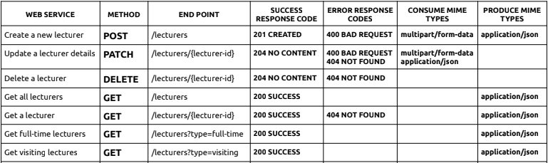

# Edu Panal
## Introduction

Welcome to EduPanel, a comprehensive education management system with a Controller - Service - Repository architecture. This project includes a back-end API developed in Java using the Spring framework. EduPanel aims to streamline the management of lecturers, providing features for creating, updating, and retrieving lecturer details.

## Technologies Used

- **Backend Framework:** Spring 

- **Data Access:** Spring Data JPA

- **Authentication and Cloud Functions:** Firebase Admin SDK

- **Object Mapping:** ModelMapper

- **Database:** MySQL

- **Build Tool:** Maven

## Web services

## Entity relationship diagram

## Schema

## Version
0.1.0

## License
Copyright &copy; 2023 Pravinda. All Right Reserved  
This Project is licensed under this [MIT](License.txt)
